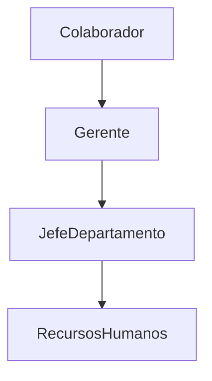

#  Bienestar BNC. Gestión de peticiones para vacaciones.

Crea y administra las solicitudes de vacaciones en tu empresa desde cualquier sitio de manera rápida y sencilla. Proyecto desarrollado en 48 horas como parte del hackatón de Aulab, realizado en la UCAB Caracas en colaboración con [@Diego Garrido](https://github.com/ByteWizzardd) y [Bloodbay8](https://github.com/Bloodbay8).
> [!TIP]
> Video pitch explicativo https://youtu.be/bYCPEpvKHbs

## Flujo de peticiones

## ¡Pruébalo tú mismo!
Puedes probar la web accediendo desde este enlace y usando una de las cuentas de prueba.

> Todas las contraseñas son *123456*  
  
**Colaborador**  
ajvielma.24@est.ucab.edu.ve  
**Gerente**  
dagarrido.23@est.ucab.edu.ve  
**Jefe de departamento**  
dacarreno.24@est.ucab.edu.ve  
**Recursos humanos**  
mariangelicaibarraluces@gmail.com

## Librerías Utilizadas 📚
- React con TypeScript
- React Router
- Supabase
- N8N
- Tailwing

## Características

### Chat bot integrado

### Pedir vacaciones de manera visual

### Aprobar o no en un solo clic

### Actualizaciones constantes de tus peticiones

### Dashboard con información relevante

### Estadísticas para tomar decisiones

### Gestión de equipo

### Calendario de tus vacaciones

